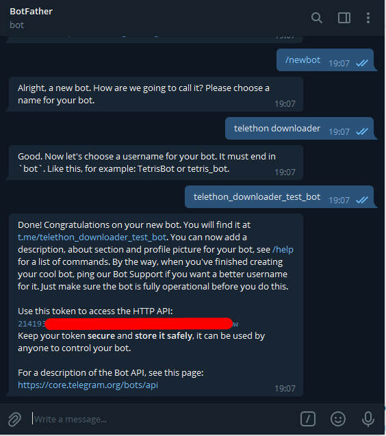

# Telethon Downloader

Telethon-downloader es un proyecto Fork de "rodriguezst", el cual está abandonado hace mas de 2 años y que dockerizamos principalmente para su uso de Unraid, pero que actualmente puede ser usando en distintas plataformas.


Las ultimas mejoras incluyen:

* Descarga en carpetas por tipos de archivos
* Descarga de imagenes con y sin compresión
* Descarga de archivos .torrent (para enviarlos a la carpeta watch de su cliente torrent)
* Descarga en carpeta por nombres de archivos (ejemplo en el config.ini de la carpeta /config)

github: [https://github.com/jsavargas/telethon\_downloader](https://github.com/jsavargas/telethon\_downloader)

dockerhub: [https://hub.docker.com/r/jsavargas/telethon\_downloader](https://hub.docker.com/r/jsavargas/telethon\_downloader)

<figure><figcaption></figcaption></figure>


## docker-compose.yml

```yaml
version: '3'
 
services:
 
  telethon_downloader:
    image: jsavargas/telethon_downloader
    container_name: telethon_downloader
    restart: unless-stopped
    network_mode: host
    environment:
      - 'PUID=1000'
      - 'PGID=1000'
      - 'TG_AUTHORIZED_USER_ID='  #<telegram chat_id authorized>
      - 'TG_API_ID='
      - 'TG_API_HASH=' 
      - 'TG_BOT_TOKEN='
      - 'TG_PROGRESS_DOWNLOAD=True' #OPTIONAL
      - 'TZ=America/Santiago'
    volumes:
      - /path/to/config:/config
      - /path/to/download:/download
      - /path/to/download/torrent/watch:/watch
```

## **Variables obligatorias**

* TG\_API\_ID&#x20;
* TG\_API\_HASH&#x20;
* TG\_BOT\_TOKEN&#x20;
* TG\_AUTHORIZED\_USER\_ID&#x20;

### Como obtener **TG\_API\_ID** / **TG\_API\_HASH**&#x20;

Para obtener estos valores, deberemos entrar en esta web [https://my.telegram.org/auth](https://my.telegram.org/auth) y generar la api

#### Paso a paso

* Entra**re**mos en [https://my.telegram.org/auth](https://my.telegram.org/auth)

<figure><figcaption></figcaption></figure>

* Confirmamos con la clave que nos enviarán por mensaje a Telegram

<figure><figcaption></figcaption></figure>

* Luego iremos a la sección de API

<figure><figcaption></figcaption></figure>

* Deberemos rellenar los campos que son requeridos y pinchar en "create application"

<figure><figcaption></figcaption></figure>

* Y se nos presenta los dos valores que nos interesan. Api\_id y Api\_hash.

<figure><figcaption></figcaption></figure>

## _IMPORTANTE!!!!!!!!!_

_Estos valores no debemos difundirlos… son únicos y NO podemos cambiarlos. Es decir no hay revocación posible como ocurre con el token. Estos valores deberemos anotarlos ya que tendremos que utilizarlos en las variables de entorno. Tampoco debemos apretar en esta opcion, ya que está elimina la cuenta de telegram._

<figure><figcaption></figcaption></figure>

## Como obtener **TG\_BOT\_TOKEN**&#x20;

El primer paso para crear tu bot es hacer que Telegram sepa que existe. Para ello en el buscador de Telegram busca: [BotFather](https://t.me/BotFather). Abre el resultado llamado _@BotFather_ y que tiene una marca de verificación azul.

<figure><figcaption><p><a href="https://t.me/BotFather">https://t.me/BotFather</a></p></figcaption></figure>

Interactuar con BotFather consiste en intercambiar mensajes. Precione el boton “Start” y aparecerán una serie de comandos. Cada uno le servirá para personalizar tu bot al máximo.

Vamos a crear el bot ejecutando el comando `/newbot` o dando clic a dicho comando. Te va a preguntar el nombre del bot y luego el username. En mi caso le llamaré **telethon downloader**. Para colocar el username es importante que el nombre termine en “bot” y no puede iniciar con un número. Yo le llamaré **telethon\_downloader\_test\_bot**.

<figure><figcaption></figcaption></figure>

Con eso su bot ya está creado. Ahora aparecerá un mensaje con recomendaciones, la URL del bot y su token de acceso. **No comparta con nadie este token,** cualquiera que lo tenga podría utilizar su bot.

## Como obtener **TG\_AUTHORIZED\_USER\_ID**

En esta variable, deberas ingresar tu **ID** de usuario de telegram, para que solo tu puedas enviarle archivos y/o interactuar con el.

* También puedes agregar el id de otro usuario separado por comas ejemplo id1,id2,id3,.....
* También puedes agregar el id de un grupo. Se recomienda que primero ingreses tú id, luego otros usuarios o grupos si es que lo deseas

Primero debemos iniciar el bot y entrar en esta URL cambiando [\<Your-BOT-Token>](https://api.telegram.org/bot%3CYourBOTToken%3E/getUpdates) por nuestro token. La variable "id" es su ID de usuario en telegram (TG\_AUTHORIZED\_USER\_ID)

* [https://api.telegram.org/bot\<Your-BOT-Token>/getUpda](https://api.telegram.org/bot%3CYourBOTToken%3E/getUpdates)[
  ](https://api.telegram.org/bot%3CYourBOTToken%3E/getUpdates)[
  ](https://api.telegram.org/bot%3CYourBOTToken%3E/getUpdates)

Con esto ya tendremos las 4 variables para poder usar **telethon downloader**

<figure><figcaption></figcaption></figure>

## Configuracion de Volumenes

```yaml
volumes:
  - /path/to/config:/config
  - /path/to/download:/download
  - /path/to/download/torrent/watch:/watch
```

* /**config**: Ruta donde irán los archivos de configuracion
* /**download**: Ruta de descarga de los archivos
* /**watch**: Ruta donde el gestor de torrent recibe los archivos torrent para descargarlos

### /watch

<figure><figcaption><p><strong>/watch: Ruta donde el gestor de torrent recive los archivos torrent para descargarlos</strong></p></figcaption></figure>
